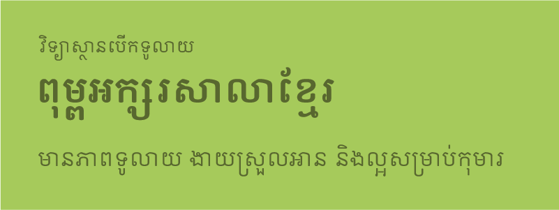
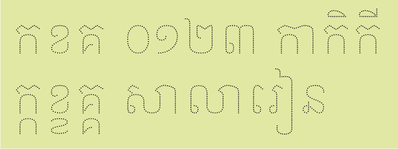
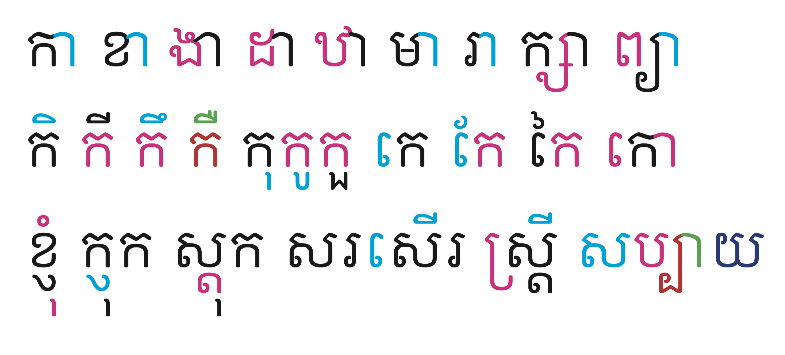

# Open Khmer School

Open Khmer School is one of the Khmer typefaces initiated by Open Insitute, with the support from RTI (Research Triangle Institute), for producing handwriting books for children. It is friendly, readable, and legible.

*The height and width of this typeface is higher and wider than the Open Khmer Text (in development.)*

## Styles

Open Khmer School comes with three variants:

### Normal (Unicode)

* Light
* Light Italic (Coming soon)
* Regular
* Italic (Coming soon)
* Bold
* Bold Italic (Coming soon)

### Dotted (Unicode)

Dotted variant is very important in this project. As its name implies, it is for making tracing paths.

* Light (Coming soon)
* Light Italic (Coming soon)
* Regular (Coming soon)
* Italic (Coming soon)

### Highlight (Non-Unicode)

Besides the Normal and Dotted variants, which are in Unicode, Highlight is created in the legacy way using Latin character set. In this project, we need more flexibility for highlighting characters in a syllable, especially in ligature forms. As a ligature usually exists between a consonant and a post-base vowel (U+17B6, U+17C4, or U+17C5), selecting the vowel in any word processing program is very tricky (as the syllable will be selected, not a character).

In order to solve this, we have come to using Latin character set, and writing OpenType features to imitate the Unicode ways (ligature, subconsonant, etc.), except the `pref` and `pres` features.

* Light (Coming soon)
* Italic (Coming soon)
* Bold (Coming soon)

## Source files

This typeface was originally designed in FontLab 5 and engineered in [Glyphs](https://glyphsapp.com). We are now converting all source files into Glyphs format, and enhancing the path outlines and master compatibility for future interpolations.

*Currently, all masters in the source files are yet compatible.*

## Changes

Please find the [Changelog.md](Changelog.md) file in this repository.

## Contributors

Open Khmer School typeface is a collaboration between [Xavier Dupré](http://xavierdupre.com) and [Sovichet Tep](https://romneatype.com). Supervised by Javier Sola from Open Institute.